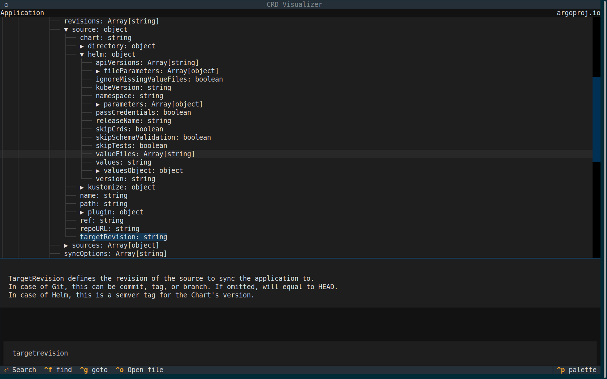

# CRD Visualiser

Visualise a CRD! CRDs are giant, and it's too hard to find the information you need in them. When you're searching for the name of a field, you have to jump past results from other fields' descriptions. When you want to see what attributes are valid at a particular level, you have to scroll past the whole tree. Even once you find what you're looking for, you have to parse OpenAPI in your head. Just don't! Let machines help.

`crdvis` presents CRDs in a concise view. The tree browser shows a CRD the way you'd want it. The `goto` function searches field names only, and the `find` function searches descriptions too. Simple field types are inlined.

## Loading a CRD

`crdvis` can load CRDs from several locations:
- your filesystem : give it a valid path or something prefixed with `file://`
- the web : urls for `http://` and `https://` will be loaded. GitHub urls will automatically request the raw file, so you don't have to click through to the "raw" version
- an active Kubernetes cluster : `kubectl://` will use kubectl to pull a CRD from your current Kubernetes cluster
- raw CRD : copypaste it in
