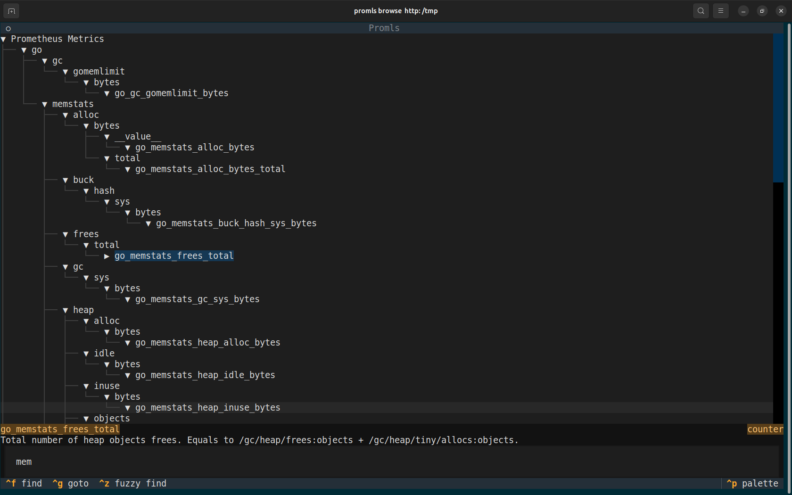

# promls : Explore Prometheus metrics

`promls` lets you explore prometheus metrics for your services. Target the metrics endpoint of your service and search for relevant metrics.

## Usage

### CLI

`promls` has cli modes. Filter for metrics by name, path, any field, or a fuzzy match.

```shell
> promls name --filter cpu http://localhost:9402/metrics
process_cpu_seconds_total (counter) Total user and system CPU time spent in seconds.
```

You can output the metrics in several formats:
- flat: a compact list, useful for humans
  ```text
  process_cpu_seconds_total (counter) Total user and system CPU time spent in seconds.
  ```
- json: for scripting
  ```json
  {
  "process_cpu_seconds_total": {
      "name": "process_cpu_seconds_total",
      "help": "Total user and system CPU time spent in seconds.",
      "type": "counter"
    }
  }
  ```
- tree: use the words as nodes in a tree
  ```text
  process
    cpu
      seconds
        total : process_cpu_seconds_total (counter) Total user and system CPU time spent in seconds.
  ```
- full: like the prometheus metric format
  ```text
  # HELP process_cpu_seconds_total Total user and system CPU time spent in seconds.
  # TYPE process_cpu_seconds_total counter
  process_cpu_seconds_total

  ```

### TUI

Interactively filter and explore the metrics.


## Bibliography

- [Prometheus metric format](https://docs.google.com/document/d/1ZjyKiKxZV83VI9ZKAXRGKaUKK2BIWCT7oiGBKDBpjEY/mobilebasic) : Actual grammar for Prometheus metrics
